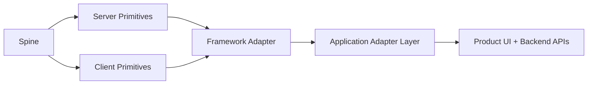

# Spine

[](https://github.com/eminuckan/spine/actions/workflows/ci.yml)
[](https://www.npmjs.com/package/@eminuckan/spine)
[](LICENSE)

Framework-agnostic SaaS primitives for authentication, identity, permissions, multi-tenancy, API access, realtime events, query configuration, and logging.

Spine is designed around one idea: the reusable parts of a SaaS platform should live in a single package, while application policy and framework quirks should stay in thin adapters. Today the package ships a framework-agnostic core plus a React Router adapter surface. Future adapters can follow the same pattern.

## Status

- Core package: `@eminuckan/spine`
- Current adapter: `@eminuckan/spine/react-router`
- Server primitives use Web `Request`/`Response` objects, not framework-specific response helpers
- React Router adapter is intentionally thin today so other adapters can be added without changing the core contract
- Extracted from repeated production-facing SaaS frontend infrastructure needs, then rebooted as an independent OSS package

## Why Spine

Most internal app infrastructure starts the same way: one product grows an auth layer, a tenant switcher, permission checks, a query client, an API wrapper, and a realtime client. Then a second product appears and copies all of it. Spine exists to stop that drift.

Spine aims to be:

- Framework-agnostic at its core
- Adapter-friendly for framework integration
- Config-driven for backend conventions
- Honest about boundaries between reusable primitives and app-specific policy
- Small enough to understand, flexible enough to extend

## Design Principles

- Core before adapter: framework-specific behavior belongs in dedicated adapter entry points
- Configure, do not fork: backend claim names, cookie behavior, endpoints, and redirects should be configured first
- Request/Response first: server modules should work anywhere a standard Web `Request` and `Response` exist
- App policy stays local: setup flows, entitlement gates, product-specific redirects, and permission taxonomies should live in the consuming app
- Open for composition: apps should be able to wrap Spine primitives instead of rewriting them

## Package Surfaces

| Entry point | Purpose |
| --- | --- |
| `@eminuckan/spine` | Client-side primitives and shared types |
| `@eminuckan/spine/server` | Framework-agnostic server primitives |
| `@eminuckan/spine/react-router` | React Router client adapter |
| `@eminuckan/spine/react-router/server` | React Router server adapter |
| `@eminuckan/spine/auth` | Auth types |
| `@eminuckan/spine/auth/server` | Auth/session/route protection primitives |
| `@eminuckan/spine/tenant` | Tenant store, provider, and types |
| `@eminuckan/spine/tenant/server` | Tenant cookie and server helpers |
| `@eminuckan/spine/identity` | Identity store/provider/types |
| `@eminuckan/spine/identity/server` | Identity context cache and server orchestration |
| `@eminuckan/spine/api-client` | Client-side API types and errors |
| `@eminuckan/spine/api-client/server` | Server-side API config and fetch helpers |
| `@eminuckan/spine/permissions` | Client-side permission primitives |
| `@eminuckan/spine/logging` | Logging primitives |
| `@eminuckan/spine/query-client` | TanStack Query helpers |
| `@eminuckan/spine/signalr` | Realtime client helpers |

## What Spine Includes

- OpenID Connect login, callback handling, RP-Initiated Logout, and token refresh
- Redis-backed session and OAuth state storage with user/session indexes
- Keycloak-compatible front-channel and back-channel logout handlers
- Server-side route protection primitives
- Server-side permission route protection configuration
- Multi-tenant client state and server helpers
- Identity context cache, fetch orchestration, and client store/provider
- API client factory and fetch middleware setup
- TanStack Query client defaults and cache presets
- SignalR client helpers
- Logging primitives

## What Spine Does Not Include

- Your product's setup rules
- Your product's billing or entitlement rules
- Your product's permission vocabulary
- Your backend DTOs or generated API clients
- Your page structure, layouts, or UI system

Those belong in the consuming app or in a product-specific adapter package.

## Architecture



The important boundary is between reusable infrastructure and product policy:

- Spine owns generic primitives
- Framework adapters own framework glue
- Application adapters own product-specific routing, claims, endpoints, and workflow rules

Detailed architecture notes live in [docs/architecture.md](docs/architecture.md).

## Installation

```bash
pnpm add @eminuckan/spine
```

If you use client-side React features, install peer dependencies too:

```bash
pnpm add react @tanstack/react-query
```

For a fuller setup path, see [docs/installation.md](docs/installation.md).

## Try the Example App

```bash
cd examples/react-router-saas
pnpm install
cp .env.example .env
pnpm dev
```

The example includes React Router auth routes, a protected dashboard loader, client provider wiring, and local app adapters for backend identity and tenant conventions.

## Environment Variables

The built-in auth/session layer currently reads these environment variables:

| Variable | Required | Purpose |
| --- | --- | --- |
| `OIDC_AUTHORITY` | Yes | OpenID Connect issuer base URL |
| `OIDC_CLIENT_ID` | Yes | Client identifier |
| `OIDC_REDIRECT_URI` | Yes | OIDC callback URL |
| `OIDC_CLIENT_SECRET` | No | Client secret for confidential clients |
| `OIDC_CLIENT_AUTH_METHOD` | No | `none`, `client_secret_post`, or `client_secret_basic` |
| `OIDC_SCOPE` | No | Requested scope string. Defaults to `openid profile email api` |
| `OIDC_POST_LOGOUT_REDIRECT_URI` | No | Logout return URL |
| `OIDC_APPLICATION_TYPE` | No | `no-landing-page`, `landing-page`, or legacy aliases |
| `OIDC_HAS_LANDING_PAGE` | No | Explicit landing-page behavior override |
| `OIDC_ALLOW_INSECURE_REQUESTS` | No | Allows non-HTTPS OIDC issuer calls only outside production |
| `REDIS_URL` | No | Redis connection string for sessions and OAuth state |
| `REDIS_KEY_PREFIX` | No | Prefix for Redis keys |
| `API_BASE_URL` | No | Optional fallback API base URL for `createAPIConfigFactory` |

## OIDC Session Lifecycle

Spine treats the OIDC provider as the identity/session authority and the app as a relying party with its own Redis session. The default logout behavior follows RP-Initiated Logout:

- `/auth/logout` clears the current app session and redirects to the provider end-session endpoint.
- `/auth/logout?logout=local` clears only the current app session. Use this for automatic cleanup after token refresh failure or expired local state.
- `/auth/logout?logout=all` revokes all known app sessions for the current user, clears their Redis session indexes, and then redirects to the provider end-session endpoint.

For Keycloak clients, wire the provider logout callbacks to thin app routes that call Spine:

```ts
// app/routes/auth/backchannel-logout.ts
import { handleBackChannelLogout } from '@eminuckan/spine/react-router/server';

export async function action({ request }: { request: Request }) {
  return handleBackChannelLogout(request);
}
```

```ts
// app/routes/auth/frontchannel-logout.ts
import { handleFrontChannelLogout } from '@eminuckan/spine/react-router/server';

export async function loader({ request }: { request: Request }) {
  return handleFrontChannelLogout(request);
}
```

In Keycloak, configure the client with:

- Backchannel Logout URL: `https://your-app.example.com/auth/backchannel-logout`
- Backchannel Logout Session Required: enabled
- Frontchannel Logout URL: `https://your-app.example.com/auth/frontchannel-logout`
- Frontchannel Logout Session Required: enabled

Back-channel logout verifies the signed `logout_token` against the provider JWKS and destroys sessions by `sid` or `sub`. Front-channel logout validates `iss` and destroys sessions by `sid` when Keycloak sends it.

## Quick Start

### 1. Configure Identity and Tenant Adapters

Spine's server modules are generic, so your app should provide backend-specific fetchers once.

```ts
// app/lib/spine/identity.server.ts
import {
  configureIdentityAPIFetcher,
  configurePermissionFetcher,
  contextToUserInfo,
  getIdentityContext,
} from '@eminuckan/spine/identity/server';
import { createAPIConfigFactory } from '@eminuckan/spine/api-client/server';
import { getAccessToken } from '@eminuckan/spine/react-router/server';
import { getCurrentTenant } from '@eminuckan/spine/tenant/server';

const { createAPIConfig } = createAPIConfigFactory(getAccessToken, getCurrentTenant);

configureIdentityAPIFetcher(async (request) => {
  const config = await createAPIConfig(request, {
    requireTenant: false,
    includeAuth: true,
  });

  const response = await fetch(`${config.basePath}/api/me/context`, {
    headers: config.headers,
  });

  if (!response.ok) {
    throw new Error(`Failed to load identity context: ${response.status}`);
  }

  return response.json();
});

configurePermissionFetcher(async (request, tenantId) => {
  const config = await createAPIConfig(request, { requireTenant: false });
  const response = await fetch(`${config.basePath}/api/me/permissions?tenantId=${tenantId}`, {
    headers: config.headers,
  });

  if (!response.ok) {
    return [];
  }

  const payload = await response.json();
  return payload.permissions || [];
});

export { contextToUserInfo, getIdentityContext };
```

```ts
// app/lib/spine/tenant.server.ts
import {
  configureTenantResolution,
  configureTenantCookie,
  getAvailableTenants,
  getCurrentTenant,
  initializeTenant,
} from '@eminuckan/spine/tenant/server';
import { fetchIdentityContext } from './identity.server';

configureTenantCookie({
  httpOnly: false,
  sameSite: 'Lax',
});

configureTenantResolution({
  identityContextFetcher: fetchIdentityContext,
});

export {
  getAvailableTenants,
  getCurrentTenant,
  initializeTenant,
};
```

### 2. Configure Server-Side Permission Protection

```ts
// app/lib/spine/permissions.server.ts
import {
  configurePermissionRouteProtection,
  requirePermission,
} from '@eminuckan/spine/server';
import { getAuthSession } from '@eminuckan/spine/react-router/server';
import { contextToUserInfo, getIdentityContext } from './identity.server';
import { getCurrentTenant } from './tenant.server';

configurePermissionRouteProtection({
  getSession: getAuthSession,
  resolveContext: async (request, session) => {
    if (!session.user?.sub) {
      return { permissions: [], currentTenant: null };
    }

    const identityContext = await getIdentityContext(request, session.user.sub);
    const currentTenant = await getCurrentTenant(request);
    const userInfo = await contextToUserInfo(identityContext, {
      currentTenant,
      request,
    });

    return {
      permissions: userInfo.permissions,
      currentTenant: userInfo.currentTenant,
    };
  },
});

export { requirePermission };
```

### 3. Protect Routes

```ts
// app/routes/_protected.tsx
import { authRoute, getAccessToken } from '@eminuckan/spine/react-router/server';
import { getCurrentTenant, initializeTenant } from '~/lib/spine/tenant.server';
import { contextToUserInfo, getIdentityContext } from '~/lib/spine/identity.server';

export async function loader({ request }: { request: Request }) {
  return authRoute(request, async (user) => {
    const [accessToken, identityContext, currentTenant] = await Promise.all([
      getAccessToken(request),
      getIdentityContext(request, user.sub),
      getCurrentTenant(request),
    ]);

    const initResult =
      !currentTenant && identityContext.hasAnyMembership
        ? await initializeTenant(request)
        : null;

    const userInfo = await contextToUserInfo(identityContext, {
      currentTenant: initResult?.tenantId ?? currentTenant,
      request,
    });

    return {
      user,
      accessToken,
      identity: {
        ...identityContext,
        permissions: userInfo.permissions,
        currentTenant: userInfo.currentTenant,
      },
      tenantHeaders: initResult?.headers ?? null,
    };
  });
}
```

### 4. Wire Client Providers

```tsx
import { QueryClientProvider } from '@tanstack/react-query';
import {
  TenantProvider,
  IdentityContextProvider,
  PermissionInitializer,
  createQueryClient,
} from '@eminuckan/spine';

const queryClient = createQueryClient();

export function AppProviders({
  children,
  tenant,
  identity,
  accessToken,
}: {
  children: React.ReactNode;
  tenant: { currentTenant: string | null; availableTenants: string[]; memberships: any[] };
  identity: { permissions: string[]; isLoading?: boolean } & Record<string, unknown>;
  accessToken?: string | null;
}) {
  return (
    <QueryClientProvider client={queryClient}>
      <TenantProvider
        initialTenant={tenant.currentTenant}
        initialTenants={tenant.availableTenants}
        initialMemberships={tenant.memberships}
      >
        <IdentityContextProvider
          initialContext={identity}
          accessToken={accessToken}
        >
          <PermissionInitializer
            permissions={identity.permissions as string[]}
            isLoading={Boolean(identity.isLoading)}
          >
            {children}
          </PermissionInitializer>
        </IdentityContextProvider>
      </TenantProvider>
    </QueryClientProvider>
  );
}
```

### 5. Configure Backend Conventions Instead of Forking

```ts
import {
  configureAuthClaimMapping,
  configureIdentityStore,
  configureRouteProtection,
} from '@eminuckan/spine/server';

configureAuthClaimMapping({
  tenantIds: ['tenant_ids'],
  tenantRoles: ['tenant_roles'],
  permissions: ['permissions', 'scope'],
  isOnboarded: ['is_onboarded'],
});

configureIdentityStore({
  contextEndpoint: '/api/me/context',
  permissionsEndpoint: '/api/me/permissions',
  logoutPath: '/session/logout',
});

configureRouteProtection({
  getLoginReturnUrl: ({ request }) => new URL(request.url).pathname,
});
```

Client contracts are configurable too. Simple apps can use endpoint configuration; apps with workspace/account/customer-specific contracts can provide `fetchTenantData`, `switchTenant`, `fetchContext`, and `fetchPermissions` functions. API header names are configurable through `createAPIConfigFactory`.

More adaptation examples live in [docs/backend-adaptation.md](docs/backend-adaptation.md).

## Module Guides

- [Architecture](docs/architecture.md)
- [Installation](docs/installation.md)
- [Adapters](docs/adapters.md)
- [Backend Adaptation](docs/backend-adaptation.md)
- [Module Reference](docs/module-reference.md)
- [Roadmap](ROADMAP.md)
- [Codex Maintenance Plan](docs/codex-maintenance.md)
- [Releasing](docs/releasing.md)
- [Contributing](CONTRIBUTING.md)
- [Maintainers](MAINTAINERS.md)
- [Security](SECURITY.md)
- [Code of Conduct](CODE_OF_CONDUCT.md)

## Current Boundaries

Spine already owns the reusable infrastructure for:

- Session lifecycle
- OAuth state and token refresh
- Tenant state and tenant cookie handling
- Identity cache and permission resolution
- Permission route protection
- API client setup

Consuming apps should still own:

- Product-specific setup pages and redirects
- Product-specific billing or entitlement policies
- Permission constants and domain vocabulary
- Generated API clients
- UI-specific wrappers and design system components

## Roadmap

The active roadmap lives in [ROADMAP.md](ROADMAP.md). Current tracks include:

- First-class Next.js adapter surface
- Clerk and Supabase integration guidance
- More adapter authoring tests and examples
- Cleaner migration from deprecated compatibility aliases
- Public API stability review before `1.0`

## Development

```bash
pnpm install
pnpm check
```

Detailed contributor guidance lives in [CONTRIBUTING.md](CONTRIBUTING.md).

## Versioning

Spine currently uses semver with a `0.x` release line. Breaking changes can still happen more frequently than a mature `1.x` package, but they should be documented in [CHANGELOG.md](CHANGELOG.md).

## License

[MIT](LICENSE)
