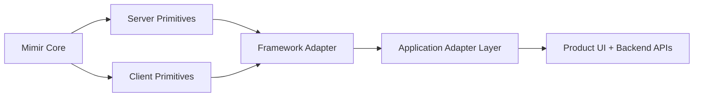

# Mimir Core

Framework-agnostic SaaS primitives for authentication, identity, permissions, multi-tenancy, API access, realtime events, query configuration, and logging.

Mimir is designed around one idea: the reusable parts of a SaaS platform should live in a single package, while application policy and framework quirks should stay in thin adapters. Today the package ships a framework-agnostic core plus a React Router adapter surface. Future adapters can follow the same pattern.

## Status

- Core package: `@eminuckan/mimir-core`
- Current adapter: `@eminuckan/mimir-core/react-router`
- Server primitives use Web `Request`/`Response` objects, not framework-specific response helpers
- React Router adapter is intentionally thin today so other adapters can be added without changing the core contract

## Why Mimir

Most internal app infrastructure starts the same way: one product grows an auth layer, a tenant switcher, permission checks, a query client, an API wrapper, and a realtime client. Then a second product appears and copies all of it. Mimir exists to stop that drift.

Mimir aims to be:

- Framework-agnostic at its core
- Adapter-friendly for framework integration
- Config-driven for backend conventions
- Honest about boundaries between reusable primitives and app-specific policy
- Small enough to understand, flexible enough to extend

## Design Principles

- Core before adapter: framework-specific behavior belongs in dedicated adapter entry points
- Configure, do not fork: backend claim names, cookie behavior, endpoints, and redirects should be configured first
- Request/Response first: server modules should work anywhere a standard Web `Request` and `Response` exist
- App policy stays local: onboarding flows, subscription gates, product-specific redirects, and permission taxonomies should live in the consuming app
- Open for composition: apps should be able to wrap Mimir primitives instead of rewriting them

## Package Surfaces

| Entry point | Purpose |
| --- | --- |
| `@eminuckan/mimir-core` | Client-side primitives and shared types |
| `@eminuckan/mimir-core/server` | Framework-agnostic server primitives |
| `@eminuckan/mimir-core/react-router` | React Router client adapter |
| `@eminuckan/mimir-core/react-router/server` | React Router server adapter |
| `@eminuckan/mimir-core/auth` | Auth types |
| `@eminuckan/mimir-core/auth/server` | Auth/session/route protection primitives |
| `@eminuckan/mimir-core/tenant` | Tenant store, provider, and types |
| `@eminuckan/mimir-core/tenant/server` | Tenant cookie and server helpers |
| `@eminuckan/mimir-core/identity` | Identity store/provider/types |
| `@eminuckan/mimir-core/identity/server` | Identity context cache and server orchestration |
| `@eminuckan/mimir-core/api-client` | Client-side API types and errors |
| `@eminuckan/mimir-core/api-client/server` | Server-side API config and Axios helpers |
| `@eminuckan/mimir-core/permissions` | Client-side permission primitives |
| `@eminuckan/mimir-core/logging` | Logging primitives |
| `@eminuckan/mimir-core/query-client` | TanStack Query helpers |
| `@eminuckan/mimir-core/signalr` | Realtime client helpers |

## What Mimir Includes

- OAuth2/OIDC login, callback handling, logout, and token refresh
- Redis-backed session and OAuth state storage
- Server-side route protection primitives
- Server-side permission route protection configuration
- Multi-tenant client state and server helpers
- Identity context cache, fetch orchestration, and client store/provider
- API client factory and Axios interceptor setup
- TanStack Query client defaults and cache presets
- SignalR client helpers
- Logging primitives

## What Mimir Does Not Include

- Your product's onboarding rules
- Your product's subscription rules
- Your product's permission vocabulary
- Your backend DTOs or generated API clients
- Your page structure, layouts, or UI system

Those belong in the consuming app or in a product-specific adapter package.

## Architecture



The important boundary is between reusable infrastructure and product policy:

- Mimir Core owns generic primitives
- Framework adapters own framework glue
- Application adapters own product-specific routing, claims, endpoints, and workflow rules

Detailed architecture notes live in [docs/architecture.md](docs/architecture.md).

## Installation

```bash
pnpm add @eminuckan/mimir-core
```

If you use client-side React features, install peer dependencies too:

```bash
pnpm add react @tanstack/react-query
```

## Environment Variables

The built-in auth/session layer currently reads these environment variables:

| Variable | Required | Purpose |
| --- | --- | --- |
| `OIDC_AUTHORITY` | Yes | OAuth/OIDC issuer base URL |
| `OIDC_CLIENT_ID` | Yes | Client identifier |
| `OIDC_REDIRECT_URI` | Yes | OAuth callback URL |
| `OIDC_CLIENT_SECRET` | No | Client secret for confidential clients |
| `OIDC_SCOPE` | No | Requested scope string |
| `OIDC_POST_LOGOUT_REDIRECT_URI` | No | Logout return URL |
| `OIDC_APPLICATION_TYPE` | No | `no-landing-page`, `landing-page`, or legacy aliases |
| `OIDC_SSO_LOGOUT` | No | Explicit full-logout override |
| `OIDC_HAS_LANDING_PAGE` | No | Explicit landing-page behavior override |
| `REDIS_URL` | No | Redis connection string for sessions and OAuth state |
| `REDIS_KEY_PREFIX` | No | Prefix for Redis keys |
| `API_BASE_URL` | No | Default API base URL for `createAPIConfigFactory` |

## Quick Start

### 1. Configure Identity and Tenant Adapters

Mimir's server modules are generic, so your app should provide backend-specific fetchers once.

```ts
// app/lib/mimir/identity.server.ts
import {
  configureIdentityAPIFetcher,
  configurePermissionFetcher,
  contextToUserInfo,
  getIdentityContext,
} from '@eminuckan/mimir-core/identity/server';
import { createAPIConfigFactory } from '@eminuckan/mimir-core/api-client/server';
import { getAccessToken } from '@eminuckan/mimir-core/react-router/server';
import { getCurrentTenant } from '@eminuckan/mimir-core/tenant/server';
import { Configuration, IdentityApi } from '~/lib/api-clients/api';

const { createAPIConfig } = createAPIConfigFactory(getAccessToken, getCurrentTenant);

configureIdentityAPIFetcher(async (request) => {
  const config = await createAPIConfig(request, {
    requireTenant: false,
    includeAuth: true,
  });

  const api = new IdentityApi(
    new Configuration({
      basePath: config.basePath,
      accessToken: config.accessToken,
      baseOptions: { headers: config.headers },
    })
  );

  const response = await api.identityGetMyContext();

  return {
    ...response.data,
    contextVersion: Date.now(),
    hasSubscription: Boolean(
      response.data.onboarding?.subscription?.exists &&
      ['active', 'trialing'].includes(response.data.onboarding?.subscription?.status || '')
    ),
  };
});

configurePermissionFetcher(async (request, tenantId) => {
  const config = await createAPIConfig(request, { requireTenant: false });
  const api = new IdentityApi(
    new Configuration({
      basePath: config.basePath,
      accessToken: config.accessToken,
      baseOptions: { headers: config.headers },
    })
  );

  const response = await api.identityGetMyPermissions(tenantId);
  return response.data.permissions || [];
});

export { contextToUserInfo, getIdentityContext };
```

```ts
// app/lib/mimir/tenant.server.ts
import {
  configureIdentityContextFetcher,
  configureTenantCookie,
  getAvailableTenants,
  getCurrentTenant,
  initializeTenant,
} from '@eminuckan/mimir-core/tenant/server';
import { fetchIdentityContext } from './identity.server';

configureTenantCookie({
  httpOnly: false,
  sameSite: 'Lax',
});

configureIdentityContextFetcher(fetchIdentityContext);

export {
  getAvailableTenants,
  getCurrentTenant,
  initializeTenant,
};
```

### 2. Configure Server-Side Permission Protection

```ts
// app/lib/mimir/permissions.server.ts
import {
  configurePermissionRouteProtection,
  requirePermission,
} from '@eminuckan/mimir-core/server';
import { getAuthSession } from '@eminuckan/mimir-core/react-router/server';
import { contextToUserInfo, getIdentityContext } from './identity.server';
import { getCurrentTenant } from './tenant.server';

configurePermissionRouteProtection({
  getSession: getAuthSession,
  resolveContext: async (request, session) => {
    if (!session.user?.sub) {
      return { permissions: [], currentTenant: null };
    }

    const identityContext = await getIdentityContext(request, session.user.sub);
    const currentTenant = await getCurrentTenant(request);
    const userInfo = await contextToUserInfo(identityContext, {
      currentTenant,
      request,
    });

    return {
      permissions: userInfo.permissions,
      currentTenant: userInfo.currentTenant,
    };
  },
});

export { requirePermission };
```

### 3. Protect Routes

```ts
// app/routes/_protected.tsx
import { authRoute, getAccessToken } from '@eminuckan/mimir-core/react-router/server';
import { getCurrentTenant, initializeTenant } from '~/lib/mimir/tenant.server';
import { contextToUserInfo, getIdentityContext } from '~/lib/mimir/identity.server';

export async function loader({ request }: { request: Request }) {
  return authRoute(request, async (user) => {
    const [accessToken, identityContext, currentTenant] = await Promise.all([
      getAccessToken(request),
      getIdentityContext(request, user.sub),
      getCurrentTenant(request),
    ]);

    const initResult =
      !currentTenant && identityContext.hasAnyMembership
        ? await initializeTenant(request)
        : null;

    const userInfo = await contextToUserInfo(identityContext, {
      currentTenant: initResult?.tenantId ?? currentTenant,
      request,
    });

    return {
      user,
      accessToken,
      identity: {
        ...identityContext,
        permissions: userInfo.permissions,
        currentTenant: userInfo.currentTenant,
      },
      tenantHeaders: initResult?.headers ?? null,
    };
  });
}
```

### 4. Wire Client Providers

```tsx
import { QueryClientProvider } from '@tanstack/react-query';
import {
  TenantProvider,
  IdentityContextProvider,
  PermissionInitializer,
  createQueryClient,
} from '@eminuckan/mimir-core';

const queryClient = createQueryClient();

export function AppProviders({
  children,
  tenant,
  identity,
  accessToken,
}: {
  children: React.ReactNode;
  tenant: { currentTenant: string | null; availableTenants: string[]; memberships: any[] };
  identity: { permissions: string[]; isLoading?: boolean } & Record<string, unknown>;
  accessToken?: string | null;
}) {
  return (
    <QueryClientProvider client={queryClient}>
      <TenantProvider
        initialTenant={tenant.currentTenant}
        initialTenants={tenant.availableTenants}
        initialMemberships={tenant.memberships}
      >
        <IdentityContextProvider
          initialContext={identity}
          accessToken={accessToken}
        >
          <PermissionInitializer
            permissions={identity.permissions as string[]}
            isLoading={Boolean(identity.isLoading)}
          >
            {children}
          </PermissionInitializer>
        </IdentityContextProvider>
      </TenantProvider>
    </QueryClientProvider>
  );
}
```

### 5. Configure Backend Conventions Instead of Forking

```ts
import {
  configureAuthClaimMapping,
  configureIdentityStore,
  configureRouteProtection,
} from '@eminuckan/mimir-core/server';

configureAuthClaimMapping({
  tenantIds: ['organizations', 'tenant_ids'],
  tenantRoles: ['organization_roles', 'tenant_roles'],
  permissions: ['permissions', 'scope'],
  isOnboarded: ['profile_complete', 'is_onboarded'],
});

configureIdentityStore({
  contextEndpoint: '/api/me/context',
  permissionsEndpoint: '/api/me/permissions',
  logoutPath: '/session/logout',
});

configureRouteProtection({
  getLoginReturnUrl: ({ request }) => new URL(request.url).pathname,
});
```

More adaptation examples live in [docs/backend-adaptation.md](docs/backend-adaptation.md).

## Module Guides

- [Architecture](docs/architecture.md)
- [Adapters](docs/adapters.md)
- [Backend Adaptation](docs/backend-adaptation.md)
- [Module Reference](docs/module-reference.md)
- [Releasing](docs/releasing.md)
- [Contributing](CONTRIBUTING.md)
- [Security](SECURITY.md)

## Current Boundaries

Mimir already owns the reusable infrastructure for:

- Session lifecycle
- OAuth state and token refresh
- Tenant state and tenant cookie handling
- Identity cache and permission resolution
- Permission route protection
- API client setup

Consuming apps should still own:

- Product-specific onboarding pages and redirects
- Product-specific subscription policies
- Permission constants and domain vocabulary
- Generated API clients
- UI-specific wrappers and design system components

## Roadmap

- First-class Next.js adapter surface
- More adapter authoring guidance
- Cleaner permission taxonomy extension story
- More example apps
- Broader runtime coverage tests

## Development

```bash
pnpm install
pnpm typecheck
pnpm build
pnpm lint
```

Detailed contributor guidance lives in [CONTRIBUTING.md](CONTRIBUTING.md).

## Versioning

Mimir currently uses semver with a `0.x` release line. Breaking changes can still happen more frequently than a mature `1.x` package, but they should be documented in [CHANGELOG.md](CHANGELOG.md).

## License

[MIT](LICENSE)
